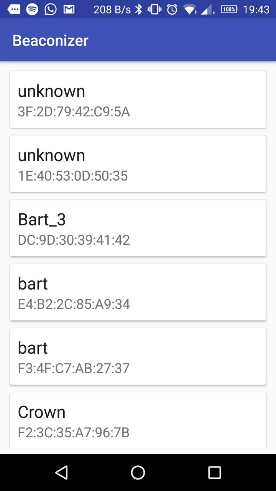

# Beaconizer

Utility to send beacon messages from Android. It is written in Kotlin. 

* It advertises by default the service UUID 3333. 
* It also scans for BLE devices and displays this in a list.

No other functions yet...

## Disclaimer

Do **not use** in production. 
This is an app written in a single day with the following purpose 
(1) to create a test setup to test the reliability of Android phones to continuously 
send out BLE advertisements, even when running in the background, and 
(2) to get some experience with Kotlin. 

## Copyright

* Author: Anne van Rossum
* Copyright: Crownstone (https://crownstone.rocks)
* Date: July 11, 2018
* License: LGPLv3+, Apache Licensen 2.0, and/or MIT (triple-licensed)